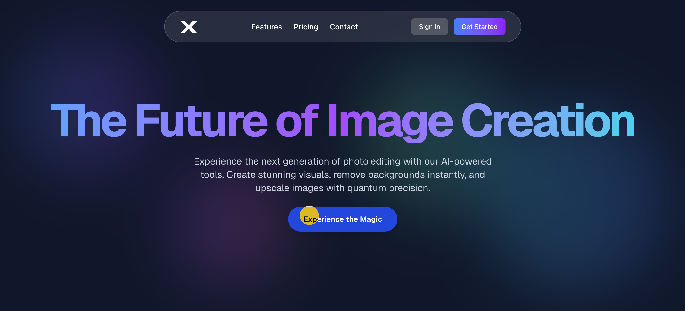
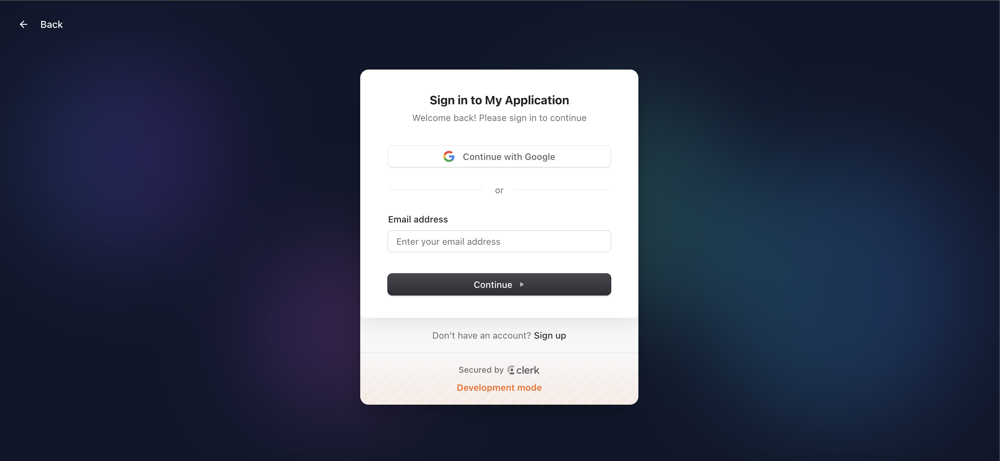
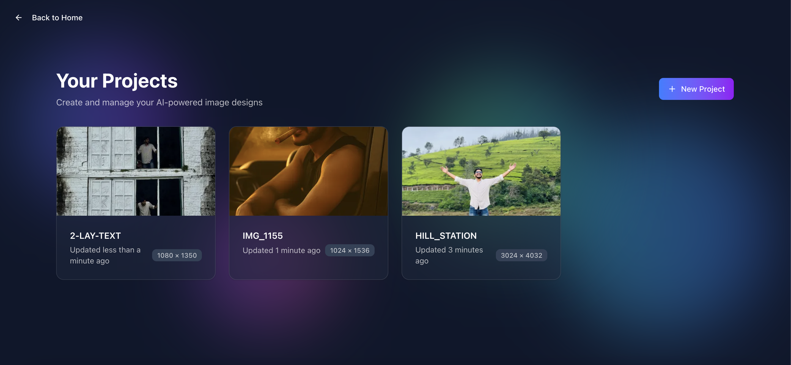
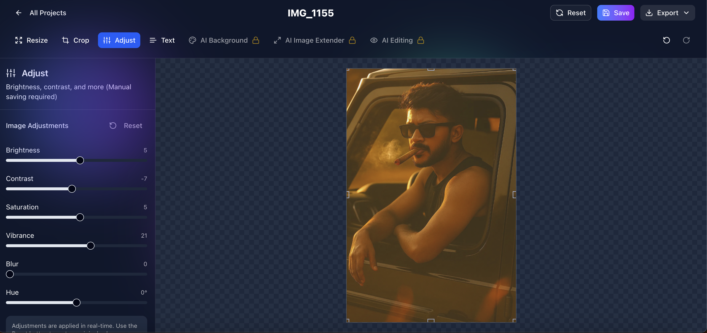

# X-Photo Editor: Open-Source AI Image Editor Code | Next.js, Convex, Clerk Full-Stack Learning Project

This document provides a comprehensive technical overview of the X-Photo Editor, an AI-powered image editing platform. Originally conceived as a hands-on learning project inspired by a content creator, it serves as a practical demonstration of integrating cutting-edge web technologies to build a real-time, interactive, and scalable application. It is designed to be an open-source resource for students and developers looking to understand modern full-stack development practices.

## 🚀 Key Features

- **Intuitive AI Image Editor:** A rich, interactive canvas for **AI-powered image manipulation** and **photo enhancement**.
- **Advanced AI Integrations:** Designed for **Vertex AI** capabilities for features like **background removal**, **image upscaling**, and **style transfer**.
- **Real-time Data Synchronization:** Leveraging **Convex** for seamless, **real-time database updates** and **serverless backend functions**.
- **Robust User Authentication:** Secure **user management** and **authentication** powered by **Clerk**, including **sign-in**, **sign-up**, and **user profiles**.
- **Responsive UI/UX:** Built with **Next.js App Router**, **Tailwind CSS**, and **Shadcn UI** for a consistent and visually appealing experience across all devices.
- **Subscription & Pricing Management:** Integrated **pricing plans** and **subscription management** features.
- **Open-Source Codebase:** A well-structured and documented **codebase** ideal for **learning full-stack web development**.

## 💻 Technology Stack

The X-Photo Editor is built upon a robust and modern technology stack, chosen for its performance, scalability, and developer experience:

- **Frontend Framework:** [Next.js](https://nextjs.org/) (App Router) & [React](https://react.dev/)
- **Styling:** [Tailwind CSS](https://tailwindcss.com/) & [Shadcn UI](https://ui.shadcn.com/)
- **Animation:** [Framer Motion](https://www.framer.com/motion/)
- **Backend & Real-time Database:** [Convex](https://www.convex.dev/)
- **Authentication:** [Clerk](https://clerk.com/)
- **Image Processing:** [ImageKit.io](https://imagekit.io/) (for API integration)
- **AI Integration:** Designed for potential integration with **Vertex AI** for advanced image manipulation and generation tasks.

## 🏛️ Architecture & Design Principles

The application follows a modern, server-rendered (SSR/SSG) architecture facilitated by Next.js, emphasizing performance and SEO. Key architectural decisions and design principles include:

- **Monorepo Structure:** A unified codebase for frontend and backend logic (within the Next.js project and Convex functions).
- **Component-Based Development:** Leveraging React's component model for modular, reusable, and maintainable UI elements.
- **Real-time Data Flow (Convex):** Convex serves as the real-time backend, providing a reactive database and serverless functions. This enables instant updates across connected clients, crucial for collaborative editing or live previews.
- **Secure Authentication (Clerk):** Clerk handles all authentication flows, including sign-in, sign-up, and user management, offloading security complexities and providing a seamless user experience.
- **API Routes (Next.js):** Utilizes Next.js API routes for server-side logic, such as handling ImageKit uploads, ensuring secure and efficient operations.
- **Scalability:** The choice of Next.js, Convex, and Clerk provides inherent scalability, allowing the application to grow with user demand without significant architectural overhauls.
- **Maintainability (SOLID Principles):** While refactoring, emphasis was placed on adhering to principles like Single Responsibility (components/functions have clear purposes) and Open/Closed (extensible without modification), contributing to a more robust and maintainable codebase.
- **Consistent Styling:** Tailwind CSS and Shadcn UI ensure a consistent and customizable design system, promoting rapid UI development and brand cohesion.

## 📚 Educational Value

This project serves as an excellent learning resource for several key modern web development concepts:

- **Full-Stack Development with Next.js:** Demonstrates the power of Next.js App Router for building full-stack applications, including server-side rendering, API routes, and static site generation.
- **Real-time Data Synchronization with Convex:** Provides a practical example of integrating Convex for real-time database updates and backend functions, showcasing its capabilities for building collaborative or highly dynamic features.
- **Authentication with Clerk:** Illustrates how to implement robust and secure authentication using Clerk, covering sign-in, sign-up, and user management flows.
- **Modern UI Development:** Showcases the use of Tailwind CSS for utility-first styling and Shadcn UI for pre-built, customizable UI components, leading to rapid and consistent UI development.
- **Code Structure and Best Practices:** Reflects efforts in code refactoring (e.g., consistent naming conventions) and adherence to principles like SOLID, providing a cleaner and more maintainable codebase for study.

## ⚙️ Setup & Local Development

To get the X-Photo Editor running locally, follow these steps:

### Prerequisites

- Node.js (v18 or higher)
- npm or Yarn
- Convex CLI (`npm install -g convex`)
- Clerk Account (for authentication)

### Installation

1.  **Clone the repository:**
    ```bash
    git clone <repository-url>
    cd x-photo-editor
    ```
2.  **Install dependencies:**
    ```bash
    npm install
    # or yarn install
    ```
3.  **Set up Convex:**
    - Log in to your Convex account and create a new project.
    - Link your local project to Convex:
      ```bash
      npx convex init
      ```
    - Ensure your Convex environment variables are set up (e.g., `CONVEX_DEPLOY_KEY`).
4.  **Set up Clerk:**
    - Create a new Clerk application in your Clerk Dashboard.
    - Copy your Clerk environment variables (`NEXT_PUBLIC_CLERK_PUBLISHABLE_KEY`, `CLERK_SECRET_KEY`) to a `.env.local` file in your project root.
5.  **ImageKit (Optional):**
    - If using ImageKit, configure your ImageKit credentials in your `.env.local` file.

### Running the Development Server

1.  **Start the Convex development server:**
    ```bash
    npx convex dev
    ```
2.  **Start the Next.js development server:**
    ```bash
    npm run dev
    ```

Your application will be accessible at `http://localhost:3000`.

## 🚀 Deployment

This application is designed for seamless deployment to [Vercel](https://vercel.com/).

1.  **Connect to Vercel:** Link your Git repository (GitHub, GitLab, Bitbucket) to a new Vercel project.
2.  **Environment Variables:** Configure the following environment variables in your Vercel project settings:
    - `NEXT_PUBLIC_CONVEX_URL`: Your production Convex deployment URL (found in your Convex dashboard).
    - Clerk environment variables (`NEXT_PUBLIC_CLERK_PUBLISHABLE_KEY`, `CLERK_SECRET_KEY`).
    - ImageKit environment variables (if applicable).
3.  **Automatic Builds:** Vercel will automatically detect the Next.js project and run `npm run build` and `npm run start` for deployments.

## 📸 Screenshots


### Landing Page



### Sign-In Page



### Dashboard Page



### Editor Page



## 🤝 Contributing

Contributions are welcome! Please feel free to open issues or submit pull requests.

## 📄 License

This project is licensed under the MIT License.
